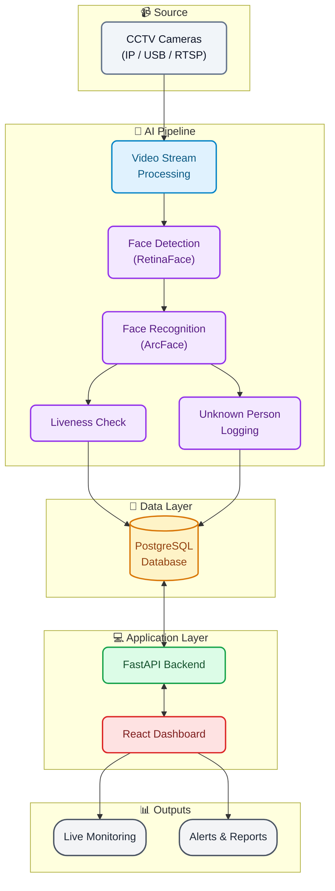

# System Architecture Flowchart

```mermaid
graph TD
    %% Styling Classes for a Premium Look
    classDef source fill:#f1f5f9,stroke:#64748b,stroke-width:2px,color:#0f172a,rx:8px,ry:8px
    classDef process fill:#e0f2fe,stroke:#0284c7,stroke-width:2px,color:#075985,rx:8px,ry:8px
    classDef ai fill:#f3e8ff,stroke:#9333ea,stroke-width:2px,color:#581c87,rx:8px,ry:8px
    classDef db fill:#fef3c7,stroke:#d97706,stroke-width:2px,color:#92400e,rx:8px,ry:8px
    classDef backend fill:#dcfce7,stroke:#16a34a,stroke-width:2px,color:#14532d,rx:8px,ry:8px
    classDef frontend fill:#fee2e2,stroke:#dc2626,stroke-width:2px,color:#7f1d1d,rx:8px,ry:8px
    classDef action fill:#f3f4f6,stroke:#4b5563,stroke-width:2px,color:#1f2937,rx:20px,ry:20px

    subgraph Input ["📹 Source"]
        direction TB
        Cameras["CCTV Cameras<br/>(IP / USB / RTSP)"]:::source
    end

    subgraph AI_Engine ["🧠 AI Pipeline"]
        direction TB
        Stream["Video Stream<br/>Processing"]:::process
        Detection["Face Detection<br/>(RetinaFace)"]:::ai
        Recognition["Face Recognition<br/>(ArcFace)"]:::ai
        Liveness["Liveness Check"]:::ai
        Unknown["Unknown Person<br/>Logging"]:::ai
        
        Stream --> Detection
        Detection --> Recognition
        Recognition --> Liveness
        Recognition --> Unknown
    end

    subgraph Storage ["💾 Data Layer"]
        direction TB
        DB[("PostgreSQL<br/>Database")]:::db
    end

    subgraph Application ["💻 Application Layer"]
        direction TB
        Backend["FastAPI Backend"]:::backend
        Dashboard["React Dashboard"]:::frontend
    end

    subgraph Output ["📊 Outputs"]
        direction TB
        Monitor("Live Monitoring"):::action
        Alerts("Alerts & Reports"):::action
    end

    %% System Flow Connections
    Cameras --> Stream
    Liveness --> DB
    Unknown --> DB
    DB <--> Backend
    Backend <--> Dashboard
    Dashboard --> Monitor
    Dashboard --> Alerts
```
